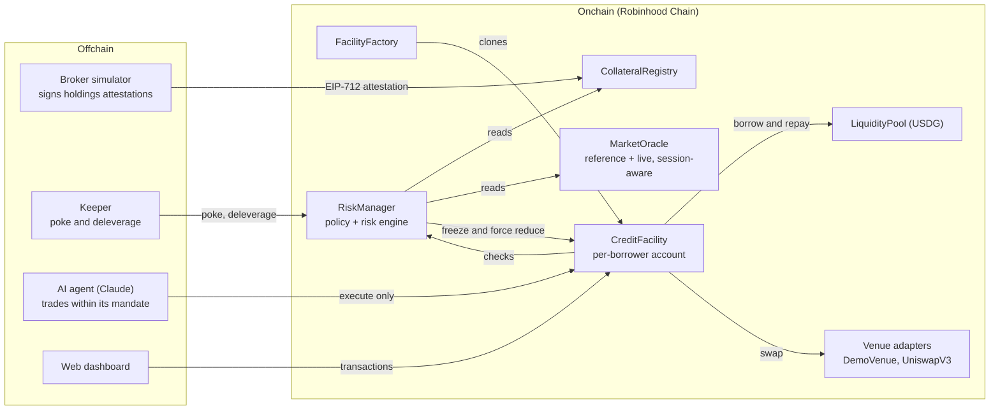

# Architecture: Hapax, Buying Power for AI Agents, Not Keys

**Project name:** hapax
**Target:** Arbitrum Open House Singapore, Online Buildathon. Promising Products (AI agents, new financial primitives) and Open category (Robinhood Chain reserved slot). USDG bonus.
**Chain:** Robinhood Chain (Arbitrum Orbit). Testnet chain id 46630, mainnet 4663.
**Version:** v0.2, 3 Oct 2026
**Lineage:** Robinhood Chain re-thesis of the baetyl design (policy-enforced credit facilities). This is a separate codebase and a separate submission.

### v0.2 changes

- **Hero changed** from "borrow against your stocks" to "give your AI agent buying power, not your keys". Plain borrowing against stocks loses to a broker margin toggle. Agents trading within limits already exist (Robinhood Agentic Trading, Coinbase Agentic Wallets, MindVault) and so does agent credit with signed bounds (Atlas Prime Book); see section 3 for what Hapax adds on top.
- **Exposure-based credit.** Borrowed USDG never leaves the facility, so the brokerage collateral backs only the stressed loss, not the face value of the loan. The same $400k account goes from $175k to $700k of buying power (section 6.3).
- **Agent mandate onchain:** the owner sets which stocks the agent may buy, a per-position cap, and an expiry, with a kill switch (section 6.6).

---

## 1. Pitch

Robinhood already lets an AI agent trade for you: since May 2026, Robinhood Agentic Trading gives an agent a separate account funded with cash you move into it. What it does not give the agent is credit: to let an agent trade $300k, you first move $300k of cash into its account, or sell stocks to raise it. Broker margin cannot be handed to an agent with limits it cannot break, and it stops repricing at Friday's close.

**Hapax gives an AI agent buying power, not keys.**

1. Your **broker attests your holdings** (shares, not dollars). That sets an onchain credit limit. Your stocks never move and are never sold.
2. You draw **USDG on Robinhood Chain** into a **facility account**, a per-borrower smart account.
3. You appoint an **agent** with a **mandate**: which stocks it may buy, a per-position cap, and an expiry. The agent can trade, but **it can never borrow, withdraw, or move funds anywhere except allowlisted venues.** Anything outside the mandate reverts onchain.
4. A **24/7 risk engine** watches every position. It deleverages automatically when risk rises and **freezes the facility in the same block** if the broker revokes. Agents trade on weekends, so the risk engine cannot stop at Friday's close: Chainlink stock feeds update 24/5, while Robinhood stock tokens trade 24/7, so Hapax revalues positions and collateral from the live onchain market while the stock market is closed.

Because the borrowed money can't leave, the collateral only has to cover what the agent could lose. That gives roughly **4x the buying power** of cash-out credit on the same account.

> One-liner: **give your AI agent buying power, not your keys. Your Robinhood stocks back a credit line it can trade 24/7, under a mandate the contract enforces.**

For lenders, Hapax opens a new borrower base for Robinhood Chain's USDG liquidity: credit backed by blue-chip equities at a regulated broker, with use of proceeds visible and enforceable onchain.

## 2. Why Robinhood Chain (and why only here)

1. **Same asset on both sides.** The offchain collateral (100 TSLA at a broker) and the onchain market (the TSLA stock token) are the same instrument. That makes the onchain price a valid weekend signal for the offchain collateral. No other chain has a native, liquid, issuer-backed stock token market to read from.
2. **The 24/5 vs 24/7 gap is real and documented.** Robinhood's own docs: "Stock feeds update 24/5, following market hours." Any lending protocol that marks stocks with the reference feed alone is marking at Friday's close all weekend. Hapax has a session-aware oracle that switches to the live market when the reference feed is closed.
3. **USDG is the settlement currency** for stock tokens on the chain. The pool lends USDG, the venue quotes in USDG, and repayment is USDG.
4. **The broker is the natural custodian.** Robinhood already custodies the shares. The attestation shape (holdings by stock token address, signed by the broker) is a drop-in path for a real brokerage integration.
5. **Robinhood already runs agentic trading** (launched May 2026, cash-funded agent accounts). Hapax is the missing credit layer for it: buying power backed by the main portfolio, with limits enforced onchain.

What we do not claim: speed. The argument is the asset, the market hours, the custodian, and the agent.

## 3. Positioning and prior art

The combination is the contribution, not any single part.

| Prior art | What it does | What it does not do |
|---|---|---|
| **Robinhood Agentic Trading** (May 2026, about 150k accounts) | An AI agent trades stocks in a separate cash account; previews, notifications, kill switch | Agent buying power is only the cash you move in (margin for agent accounts is not documented); limits live in Robinhood's backend; no weekends |
| **Coinbase Agentic Wallets**, **MindVault**, **Lit Vincent** | Agent wallets and vaults with spend limits, token whitelists, expiry, enforced by MPC or contracts | Spend the agent's own funds; no credit, no brokerage collateral |
| **Atlas Prime Book** (HackQuest project) | Agent credit and margin trading bounded by a signed ERC-7710 permission (Base Sepolia credit, GMX on Arbitrum Sepolia) | Crypto collateral and crypto perps; no brokerage equities, no market-hours model |
| **Broker margin** (Robinhood Gold, private-bank SBLOCs) | Credit against held stocks | Cannot be delegated to an agent under enforceable limits; cash leaves; offchain only; reprices in market hours |
| **Kamino** (xStocks on Solana), **Syndromics** and Aave forks such as "Edel" (Robinhood Chain) | Borrow stablecoins against tokenized stocks held onchain | Collateral must already be tokenized and moved onchain; borrowed cash is unrestricted; no agent mandate |
| **Gearbox Credit Accounts** | Isolated smart account restricted to allowed contracts | Crypto collateral only; no brokerage collateral; no agent mandate or market-hours model |
| **Aave custodied collateral lending** (ARFC, 14 Sep 2026, not live) | Institutional borrowing against custodied BTC via a non-transferable receipt | No control over borrowed funds; no equities; no market-hours model |
| **Robinhood Earn via Morpho** | USDG yield from onchain lending (about 7% APY) | Lender side only; borrowers post crypto collateral, not brokerage equities |

**Our claim, stated narrowly:** agent mandates and agent credit both exist. What we have not found is agent credit **backed by shares that stay at the broker**, **sized by exposure** because the money cannot leave, with a **risk engine that keeps working when the stock market is closed**. In product terms: Hapax is a credit layer for agentic trading accounts like Robinhood's, not a new way for agents to trade.

## 4. Real vs simulated

State this table in the README, the write-up and the demo.

| Real (built and demoed) | Simulated (labelled as such) |
|---|---|
| EIP-712 holdings attestations: verification, expiry, nonces, revocation | The broker (a service we run that signs attestations) |
| Facility smart account and per-action policy checks | Legal enforceability of the pledge |
| Session-aware oracle (reference vs live, OPEN vs CLOSED) | Testnet price feeds: Robinhood's testnet stock feeds are mocks; we deploy operator-controlled demo feeds (badged in the UI) so the crash scene is repeatable |
| Two-signal risk engine and state machine | Broker-side sale of shares on default (event plus a stub confirmation) |
| Permissionless forced reduction with oracle-bounded slippage | Lender liquidity (one pool, test funds) |
| Real Robinhood stock tokens (testnet faucet TSLA, AMZN, NFLX) and USDG | Venue liquidity: a demo venue priced off the live feed (Uniswap adapter is a spike, S1) |
| Agent mandate (token list, position cap, expiry, kill switch) and the AI agent trading through it | |
| Keeper, broker simulator, dashboard | |

## 5. System overview



**Design rules**

1. **Actions use fresh evaluation, never cached state.** Every state-increasing action calls `RiskManager.evaluate` and checks attestation status at action time. Freeze is instantaneous; the keeper only persists state for UX, events and timers.
2. **The keeper supplies no calldata.** Forced reduction sells holdings to USDG through the default venue with oracle-bounded slippage.
3. **Typed adapters, not raw calldata.** The facility calls `swap(tokenIn, tokenOut, amountIn, minOut)` on a registered adapter. Output always goes to `msg.sender` (the facility), and the facility measures balance deltas itself rather than trusting the adapter's return value.
4. **Pausing never blocks repay or reduce.**
5. **Value the offchain collateral in shares, not dollars.** The broker attests *what you hold*. The chain decides *what it is worth right now*.

## 6. Core concepts and math

All USD values are 18-decimal fixed point (WAD) internally. USDG has 6 decimals and stock tokens 18. Feeds are normalised at the oracle boundary and token amounts at the facility boundary.

### 6.1 Market session and mark price

Each stock asset has two price sources:

| Source | Mainnet | Testnet | Updates |
|---|---|---|---|
| **Reference** `P_ref` | Chainlink stock Data Feed | Demo feed (AggregatorV3) | 24/5, market hours |
| **Live** `P_live` | TWAP of the stock token's onchain market | Demo feed (AggregatorV3) | 24/7 |

**Session** is derived per asset from the reference feed's freshness. No calendar is hard-coded, so holidays and early closes work automatically:

```
session = OPEN    if now - P_ref.updatedAt <= refHeartbeat
          CLOSED  otherwise
```

**Mark price** (used for all risk valuation):

```
OPEN:   mark = P_ref                  (if |P_live - P_ref| / P_ref > maxDeviation, mark = min(P_ref, P_live))
CLOSED: mark = min(P_ref_last, P_live)   (P_live must be fresher than liveMaxAge)
CLOSED and P_live stale: mark = P_ref_last, flag DEGRADED, new borrows and increases blocked
```

`min` is the conservative choice in both directions: a weekend crash is seen immediately, but a weekend pump never inflates collateral above Friday's close.

**Unwind price** uses `P_live` (it is what the facility can actually trade at), bounded by `maxSlippageBps`.

### 6.2 Collateral and credit limit

An attestation lists positions `(asset, shares)` plus `cashUsd` and `encumberedUsd`.

```
haircut_i      = session_i == OPEN ? haircutBps_i : weekendHaircutBps_i      (gap-risk haircut)
eligibleValue  = max(0, sum(shares_i * mark_i * (1 - haircut_i)) + cashUsd - encumberedUsd)
creditLimit    = min(eligibleValue * maxLtv, maxCreditPerFacility)
```

The credit limit **shrinks automatically at Friday's close** (wider weekend haircut) and **tracks the weekend market** (live mark) without the broker re-signing anything.

### 6.3 Debt, assets and the two signals

- **Debt** `D` = principal plus accrued interest (pool-side interest index), in USD WAD.
- **Facility assets** `A` = idle USDG + sum(tokenBalance_j * mark_j) over allowlisted tokens, at mark with no haircut (the baetyl v0.2 fix: otherwise a fresh position starts at `H ≈ 1 - haircut`).
- **Stressed assets** `A_s` = idle USDG + sum(tokenBalance_j * mark_j * (1 - haircut_j(session))): what the holdings are worth after a gap move of the size the haircut assumes.
- **Exposure** `E = max(0, D - A_s)`: the part of the debt the brokerage collateral actually has to cover.

**Why exposure, not debt.** In cash-out credit the money leaves, so collateral must back the whole loan. In Hapax the borrowed USDG and whatever it buys stay inside the facility, where the lender can see them and sell them. The collateral only backs the stressed loss. Same $400k account: cash-out credit stops at $175k (70% of a $250k limit); Hapax allows **$700k** of buying power while the market is open (`175k / 25%` haircut) and $364k while it is closed (`145.6k / 40%`).

| Signal | Formula | Reacts to | Meaning |
|---|---|---|---|
| **Credit utilization** `U` | `E / creditLimit` | Position price moves, the weekend haircut, attestation changes, and *weekend repricing of the offchain shares* | How much of the brokerage-backed credit the stressed loss is using |
| **Position health** `H` | `A / D` | Price moves of what the facility bought | How much of the borrowed USDG the facility can still cover |

`H` starts at about 1.0 because borrowed funds are the facility's assets, and is expected to sit below 1.0 after losses. The brokerage collateral is the backstop. The onchain thresholds keep losses small so the slow broker path is rarely needed.

### 6.4 Severity

| Level | `U` | `H` |
|---|---|---|
| WARNING | ≥ 0.80 | < 0.95 |
| MARGIN_CALL | ≥ 0.90 | < 0.90 |
| DELEVERAGING | ≥ 1.00 | < 0.85 |

Risk level is the worse of the two. **Initial margin:** new risk must leave `U ≤ 0.70` under the current session's haircuts. A borrow is checked as if the new USDG were fully invested in the riskiest tradeable stock; every buy is re-checked after it settles. If `D = 0` the facility is healthy. Hysteresis: a persisted level downgrades only when both signals beat the lower threshold by `hysteresisBps`.

**Attestation status** is separate: NONE, VALID, STALE (past `expiresAt`), or REVOKED. STALE or REVOKED forces FROZEN regardless of risk level.

### 6.5 State machine

```mermaid
stateDiagram-v2
  [*] --> ACTIVE
  ACTIVE --> WARNING: soft threshold crossed
  WARNING --> ACTIVE: recovered with hysteresis
  WARNING --> MARGIN_CALL: call threshold
  MARGIN_CALL --> WARNING: recovered
  MARGIN_CALL --> DELEVERAGING: deleverage threshold
  DELEVERAGING --> CURE: flattened and repaid, residual debt remains
  DELEVERAGING --> ACTIVE: flattened and repaid, no residual
  ACTIVE --> FROZEN: attestation revoked or stale
  WARNING --> FROZEN: attestation revoked or stale
  MARGIN_CALL --> FROZEN: attestation revoked or stale
  FROZEN --> ACTIVE: fresh valid attestation
  FROZEN --> CURE: force-reduced, residual debt remains
  CURE --> ACTIVE: borrower repays residual
  CURE --> DEFAULT: cure window expires
  FROZEN --> DEFAULT: frozen past defaultGrace with debt
  DEFAULT --> CLOSED: broker settlement confirmed
```

Entering DEFAULT emits `ResolutionRequested` to the broker in the same transaction, so "resolution" is not a separate onchain state.

Timers: `freezeGrace < defaultGrace`, so a frozen facility is unwound before it can default. A FROZEN facility whose risk level is DELEVERAGING can be force-reduced immediately.

### 6.6 Allowed actions by state

| Action | ACTIVE | WARNING | MARGIN_CALL | DELEVERAGING | FROZEN | CURE | DEFAULT / RESOLUTION |
|---|---|---|---|---|---|---|---|
| Borrow | ✅ | ❌ | ❌ | ❌ | ❌ | ❌ | ❌ |
| Open or increase position | ✅ | ✅ (post-check) | ❌ | ❌ | ❌ | ❌ | ❌ |
| Reduce or close position (sell to USDG) | ✅ | ✅ | ✅ | ✅ | ✅ | ✅ | ❌ |
| Repay | ✅ | ✅ | ✅ | ✅ | ✅ | ✅ | ✅ |
| Deposit own USDG | ✅ | ✅ | ✅ | ✅ | ✅ | ✅ | ❌ |
| Withdraw surplus | ✅ (post-check) | ❌ | ❌ | ❌ | ❌ | ❌ | ❌ |
| Forced reduction by anyone | ❌ | ❌ | ❌ | ✅ | after `freezeGrace`, or immediately if level is DELEVERAGING | ❌ | ❌ |

**The agent mandate.** The owner calls `setAgent(agent, expiresAt, maxPositionUsd, tokens[])`. Until `expiresAt`, the agent may:

| Agent may | Agent may not |
|---|---|
| Buy stocks on its mandate list, up to `maxPositionUsd` per stock (and every global limit) | Buy anything off the list (`OutsideMandate`) or past the cap (`PositionTooLarge`) |
| Sell any holding back to USDG (reducing risk is always allowed) | Borrow, withdraw, change its own mandate, or send funds anywhere but allowlisted venues (`Unauthorized`) |
| Repay debt from idle USDG | Act after expiry or after `revokeAgent()` (the owner's kill switch) |

Every agent action also goes through the same state checks as the owner's: in MARGIN_CALL or worse, the agent cannot add risk.

### 6.7 Forced reduction

1. Anyone calls `RiskManager.deleverage(facility)`. No calldata.
2. The facility sells every allowlisted holding to USDG through the default venue, with `minOut` from `P_live` and `maxSlippageBps`.
3. A capped `keeperTipBps` tip goes to the caller; all remaining USDG repays debt.
4. Residual debt → CURE with a `cureWindow` timer. No residual → ACTIVE (or FROZEN if the attestation is still invalid).
5. MVP flattens fully. Partial deleveraging to a target ratio is a stretch goal.

### 6.8 Default and resolution (simulated)

On DEFAULT the RiskManager emits `ResolutionRequested(facility, residualDebt, custodyRef)`. The broker (simulator) sells shares offchain and calls `confirmSettlement(facility, amount, evidenceHash)`, paying `amount` USDG into the pool. Any shortfall is booked by `absorbLoss`. The facility closes.

## 7. Onchain components

### 7.1 CollateralRegistry

Verifies and stores broker holdings attestations.

```solidity
struct Position {
    address asset;   // Robinhood stock token address that represents the offchain shares
    uint256 shares;  // 1e18 = one share
}

struct Attestation {
    address facility;
    address borrower;      // must equal the facility owner
    bytes32 custodyRef;    // salted hash of the brokerage account reference; no PII onchain
    Position[] positions;  // max 8
    uint256 cashUsd;       // 1e18
    uint256 encumberedUsd; // 1e18
    uint64  issuedAt;
    uint64  expiresAt;
    uint64  nonce;         // strictly increasing per facility
}
```

- EIP-712 domain: name `Hapax`, version `1`, `chainId`, `verifyingContract`.
- Accept only if the signer is an approved broker key, `nonce` > last, `issuedAt` not in the future beyond skew, `expiresAt` in the future, `expiresAt - issuedAt <= maxTtl`, `borrower` is the facility owner, every asset is registered in the oracle, and positions ≤ 8.
- Revocation: the attesting broker calls `revoke(facility, reasonCode)`. Expiry is the dead-man switch.
- Views: `status(facility)`, `attestationOf(facility)`.
- Risk caps live in the RiskManager (`maxCreditPerFacility`).

### 7.2 FacilityFactory and CreditFacility

- `FacilityFactory` deploys ERC-1167 clones bound to the registry, pool and risk manager, one per borrower, and keeps an enumerable list for the keeper.
- `CreditFacility` holds USDG and stock tokens. Debt lives in the pool, keyed by the facility address.
- Owner: `borrow`, `repay`, `deposit`, `trade`, `withdrawSurplus`, `setAgent`, `revokeAgent`.
- Agent: `trade` (buys within the mandate, any sell), `repay`.
- RiskManager only: `forceSell`, `forceRepay`, `pay` (keeper tip) during deleverage and settlement.
- `trade` flow: classify (buy = tokenOut is a stock; sell = tokenOut is USDG) → agent buys checked against the mandate list → fresh `evaluate` → state check → policy check (adapter and token allowlisted) → exact approval → `adapter.swap` → reset approval → measure balance deltas → post-check for buys (initial margin `U ≤ 0.70`, per-stock cap = min(global cap, mandate cap for agents), `maxPerTokenBps`).
- `RiskManager.buyingPower(facility)` returns the largest borrow that passes the checks right now (UI helper).

### 7.3 Venue adapters

```solidity
interface IVenueAdapter {
    /// Pulls `amountIn` of `tokenIn` from msg.sender and sends at least `minOut` of `tokenOut` to msg.sender.
    function swap(address tokenIn, address tokenOut, uint256 amountIn, uint256 minOut) external returns (uint256 amountOut);
}
```

- `DemoVenue` + adapter: inventory-based venue that quotes at `P_live` with a fixed spread, funded by the operator. Primary testnet venue.
- `UniswapV3Adapter`: `exactInputSingle` on a configured router and fee tier. Spike S1 decides whether it is the demo venue.
- Adapters are immutable once registered; production registration is timelocked.

### 7.4 MarketOracle

- Per asset: `refFeed`, `liveFeed` (both AggregatorV3), `refHeartbeat`, `liveMaxAge`, `maxDeviationBps`, `haircutBps`, `weekendHaircutBps`.
- `quote(asset) → (mark, live, session, degraded)`.
- Base asset (USDG) is priced at $1. Production: USDG/USD feed and a depeg guard that blocks new borrows.
- Mainnet: an L2 sequencer uptime check before trusting any feed (Robinhood's docs show the pattern).
- Testnet: `DemoFeed` contracts, writable by the demo operator, so "Friday close" and "Saturday crash" are repeatable. The UI shows a "demo feed" badge.

### 7.5 LiquidityPool

- USDG only. `supply`/`withdraw` for the single test lender, `borrow`/`repay` for facilities, an interest index with a fixed APR inside hard bounds (kinked curve is stretch), `absorbLoss`.
- No pool shares in the MVP (avoids inflation and donation edge cases).
- Accounting identity: `cash + totalDebt == totalSupplied + accruedInterest - realizedLosses`.

### 7.6 RiskManager

- Owns policy and risk parameters (bounded setters).
- `evaluate(facility) → Evaluation{state, level, U, H, attStatus, creditLimit, debt, assets, anyClosed}` (view, used by every action and the keeper).
- `poke(facility)`: permissionless. Persists state, starts and clears timers, emits `StateChanged`. Idempotent.
- `deleverage(facility)`: permissionless, only when the fresh evaluation allows it.
- `confirmSettlement` (broker only) and `absorbLoss` routing.

## 8. Offchain components

| Component | Stack | Responsibility |
|---|---|---|
| **Broker simulator** | Node/TypeScript, viem | Mock brokerage accounts (shares per stock, cash). Signs holdings attestations every N seconds. Operator API: `POST /revoke`, `/encumber`, `/holdings`, `/settle`, `GET /state`. Testnet keys in env vars only. |
| **Keeper** | Node/TypeScript, viem | Every block: multicall `evaluate` over facilities, `poke` on state change, `deleverage` when allowed. Anyone can run one. |
| **Market operator** (`/market`) | Node/TypeScript, viem | Drives demo feeds: "close market" (backdates the reference past its heartbeat), "shock TSLA −16% onchain", "open market". |
| **Agent** (`/agent`) | Node/TypeScript, Claude (`claude-opus-5-5`, structured output) | Holds the facility's agent key. Each tick: reads facility and market state, asks Claude for trades as schema-validated JSON given the owner's plain-English instructions, simulates each trade, submits it, and logs onchain refusals by error name. Falls back to a deterministic rules strategy without an API key or on an API error. API: `GET /agent`, `POST /instructions`, `/tick`, `/try` (force a trade to demo a refusal). |
| **Web app** | Next.js, wagmi, viem | Facility overview, session badge (OPEN / CLOSED, "market closed, marking live"), U and H gauges, state timeline, trade ticket, readable policy panel, operator console. |
| **Indexing** | viem event poller | Upgrade to an indexer only if needed. |

**Events (minimum):** `AttestationAccepted`, `AttestationRevoked`, `FacilityOpened`, `Borrowed`, `Repaid`, `Traded`, `AgentSet`, `AgentRevoked`, `StateChanged(from, to, U, H)`, `Deleveraged`, `CureStarted`, `Defaulted`, `ResolutionRequested`, `SettlementConfirmed`, `LossAbsorbed`.

## 9. Key flows

1. **Onboard.** Borrower opens a facility → broker simulator signs a holdings attestation for it → registry verifies → credit limit visible.
2. **Borrow.** Fresh `evaluate` says ACTIVE, attestation VALID, worst-case post-borrow `U ≤ 0.70` → pool sends USDG to the facility.
3. **Appoint the agent.** Owner calls `setAgent` with a token list, per-position cap and expiry, and gives the agent service plain-English instructions.
4. **Trade.** Owner or agent calls `trade(adapter, tokenIn, tokenOut, amountIn, minOut)` → mandate check (agent buys) → policy check → swap → initial-margin and position post-check.
5. **Market close.** Reference feed goes stale → session CLOSED → weekend haircut applies, credit limit and buying power shrink, marks follow the live market. No transaction is needed for any of this.
6. **Weekend shock.** Live price drops → keeper `poke`s through WARNING and MARGIN_CALL (the agent can no longer add risk) → at DELEVERAGING anyone calls `deleverage` → holdings sold, debt repaid → residual → CURE.
7. **Revocation.** Broker revokes (account transferred, shares sold, fraud flag) → the next borrow or buy reverts as FROZEN in the same block.
8. **Cure, default, resolution.** Borrower repays the residual within `cureWindow`, or the facility defaults → `ResolutionRequested` → broker settles → CLOSED.

## 10. Security model

| Threat | Mitigation |
|---|---|
| Attestation replay or forgery | EIP-712 domain with chainId and contract, strict nonces, expiry, max TTL, borrower binding, approved broker set |
| Broker key compromise | `maxCreditPerFacility`, admin can remove a broker; production timelock and multisig |
| Weekend pump inflating collateral | Closed-session mark is `min(P_ref_last, P_live)` |
| Thin weekend liquidity / live price manipulation | Live price is a TWAP on mainnet; `min` rule means manipulation can only lower marks (a griefing vector, bounded by hysteresis and cure, not a theft vector); per-token exposure caps |
| Oracle staleness | Max ages per source, DEGRADED mode blocks borrows and increases, sequencer uptime check on mainnet |
| Malicious or buggy adapter | Allowlisted and immutable; facility measures balance deltas; exact approvals reset to zero |
| Sandwiching forced reduction | `minOut` from `P_live` and `maxSlippageBps`; hard revert |
| Agent key compromise | Operator can only trade allowlisted tokens through allowlisted venues and repay; it cannot move funds out |
| Reentrancy | Checks-effects-interactions plus guards on facility, pool, registry and risk manager |
| Keeper failure | `poke` and `deleverage` are permissionless with a tip; actions re-evaluate state, so freeze does not depend on a keeper |
| Admin abuse | Parameters clamped to hard bounds; demo uses a single admin key (disclosed) |
| Token quirks | Fee-on-transfer and rebasing tokens unsupported; decimals normalised; USDG freeze/blacklist risk documented |

## 11. Robinhood Chain notes

| Item | Testnet (46630) | Mainnet (4663) |
|---|---|---|
| RPC | `https://rpc.testnet.chain.robinhood.com` (public, rate-limited) | `https://rpc.mainnet.chain.robinhood.com` |
| Explorer | `https://explorer.testnet.chain.robinhood.com` (Blockscout) | `https://robinhoodchain.blockscout.com` |
| Faucet | `https://faucet.testnet.chain.robinhood.com` | n/a |
| TSLA stock token | `0xC9f9c86933092BbbfFF3CCb4b105A4A94bf3Bd4E` (18 dec) | see Robinhood docs |
| AMZN stock token | `0x5884aD2f920c162CFBbACc88C9C51AA75eC09E02` (18 dec) | see Robinhood docs |
| NFLX stock token | `0x3b8262A63d25f0477c4DDE23F83cfe22Cb768C93` (18 dec) | see Robinhood docs |
| USDG | `0x7E955252E15c84f5768B83c41a71F9eba181802F` ("Global Dollar", 6 dec, verify, S5) | `0x5fc5360D0400a0Fd4f2af552ADD042D716F1d168` |
| Uniswap v3 | several unofficial deployments, S1 | Factory `0x1f7d7550b1b028f7571e69a784071f0205fd2efa`, SwapRouter02 `0xcaf681a66d020601342297493863e78c959e5cb2` |

- Testnet stock tokens come with **mock** Chainlink feeds; mainnet has production feeds (8 decimals, 24/5).
- Gas token is ETH. Standard Foundry tooling works unchanged.

## 12. Testing plan

**Invariants.** These are the properties the system must hold. Today each is checked by the deterministic scenario tests below (31 tests in `contracts/test/Scenarios.t.sol`); stateful fuzzing of the same properties with Foundry's invariant runner is the next step and is not yet written.

- I1: debt never exceeds `creditLimit` at the moment of borrow.
- I2: no borrow, buy, or withdrawal succeeds in MARGIN_CALL, DELEVERAGING, FROZEN, CURE, DEFAULT or RESOLUTION.
- I3: assets leave a facility only via repay, adapter swap, surplus withdrawal in ACTIVE, keeper tip, or settlement.
- I4: pool accounting identity holds after every action.
- I5: nonces strictly increase; expired or revoked attestations never raise `creditLimit`.
- I6: closed-session mark never exceeds the last reference price.
- I7: `poke` is idempotent and caller-independent.
- I8: forced reduction never executes worse than the slippage bound.

**Scenarios (implemented):** revoke → frozen in the same block; stale attestation → frozen; Friday close shrinks the credit limit and buying power without any transaction; Saturday crash → deleverage → cure → default → settlement, including a shortfall absorbed by the pool; weekend pump does not raise the credit limit; exposure-based buying power and initial margin on buys; the agent mandate (token list, position cap, no keys, sells always allowed, kill switch, expiry); policy blocks an unlisted adapter and withdrawal of borrowed funds; attestation replay, unknown signer and borrower mismatch; the full demo storyline.

**Environments:** local Anvil with mocks → Robinhood Chain testnet with faucet stock tokens and USDG.

## 13. Repository layout

```
/contracts     Foundry: registry, oracle, pool, factory, facility, risk manager, venues, mocks
/shared        Chain config, generated ABIs, EIP-712 types (used by every TS package)
/broker        Broker simulator (attestation signer + operator API)
/keeper        Block loop: evaluate, poke, deleverage
/market        Demo market operator: drives demo feeds (open, close, shock)
/agent         AI agent: Claude turns instructions into trades through the agent key
/web           Next.js dashboard and operator console
/sim           Weekend-gap simulation: broker-only margin vs Hapax
/docs          This file, write-up, trust table
```

Toolchain: Solidity 0.8.24, Foundry, OpenZeppelin 5, viem/wagmi, Node 20+, pnpm workspaces.

## 14. Parameters (defaults for calibration)

| Asset | `haircutBps` (open) | `weekendHaircutBps` (closed) |
|---|---|---|
| Single large-cap stock (TSLA, AMZN, NFLX) | 2500 | 4000 |

| Parameter | Default |
|---|---|
| `maxLtv` | 80% |
| Initial margin (`maxBorrowUtilBps`, borrows and buys) | `U ≤ 0.70` |
| `refHeartbeat` | 1 h (testnet demo: 5 min; "close market" backdates the reference so the flip is immediate) |
| `liveMaxAge` | 10 min (demo: 5 min) |
| `maxDeviationBps` (open session) | 300 |
| Attestation TTL / `maxTtl` | 300 s / 1 h demo, hours production |
| `maxSlippageBps` on unwind | 100 |
| `keeperTipBps` (capped) | 25 |
| `cureWindow` | 120 s demo, hours production |
| `freezeGrace` / `defaultGrace` | 120 s / 300 s demo |
| `hysteresisBps` | 200 |

## 15. Build order

Priority order. Each step is demoable on its own.

1. ✅ **Contracts core:** registry, oracle, pool, factory, facility, risk manager, demo feeds and venue; 30 scenario tests green.
2. ✅ **Exposure-based credit and the agent mandate.**
3. ✅ **Broker simulator, keeper, market operator, deploy script**; end-to-end run on Anvil.
4. ✅ **Agent service** (Claude structured output, rules fallback, decoded onchain refusals).
5. **Web dashboard:** session badge, buying power, U and H gauges, mandate panel, agent decision feed with refusals, state timeline, operator console.
6. **Testnet deploy** and contract verification.
7. **Weekend-gap simulation** (`/sim`): same weekend crash, broker-only margin call at Monday's open vs Hapax deleveraging on Saturday; lender loss for each.
8. Uniswap adapter, partial deleveraging, kinked rates.

**Never cut:** registry, oracle sessions, facility policy, agent mandate, risk engine, forced reduction, revocation freeze, dashboard.

## 16. Demo script (about 3 minutes)

Demo account at the broker: 1,000 TSLA at $250 + 500 AMZN at $200 + $50k cash = $400k attested.

Market open: eligible = 250k × 0.75 + 100k × 0.75 + 50k = $312.5k → credit limit $250k → buying power $700k.
Market closed: eligible = 250k × 0.60 + 100k × 0.60 + 50k = $260k → credit limit $208k → buying power $364k.

The storyline is asserted in `contracts/test/Scenarios.t.sol` (`test_demoStoryline`, plus the market-open and market-close tests for steps 1 and 5) and was run end to end on the dashboard. Run the agent with `AGENT_INTERVAL_MS=0` so every agent action happens on cue from the demo console.

1. **Friday, market open.** The dashboard shows the brokerage holdings (no account details), credit limit $250k, buying power **$700k** against "cash-out margin, same account: $175k", session OPEN.
2. **Appoint the agent.** Draw $300k USDG. Appoint the agent: TSLA and NFLX only, **$250k per position**, expires in 24 hours. Instruction in plain English: "Trade large-cap tech. Buy dips, keep a reserve."
3. **The leash, first.** From the console, push the agent past its mandate: "Try $280k TSLA (over cap)" → `PositionTooLarge(TSLA, $279,720)`; "Try AMZN buy" → `OutsideMandate(AMZN)`. Each refusal is a reverted transaction, not a policy in our backend. (Borrowing with the agent key reverts with `Unauthorized`; show it from a terminal if time allows.)
4. **The agent trades within its mandate.** It buys $250k of TSLA; $50k stays idle (U = 0.25, H = 0.999).
5. **Friday 4:00 pm.** "Close market": reference feeds stop, the session badge flips to CLOSED, the limit drops to $208k and U rises to 0.48, with no transaction. "The broker is blind until Monday. Your agent isn't, and neither is the risk engine."
6. **Saturday crash.** Move TSLA down onchain: WARNING at −6%, MARGIN_CALL at −12% (the agent's next buy is refused with `StateNotAllowed(MARGIN_CALL)`), keeper sells at −18% (H < 0.85). TSLA is sold for USDG, debt is repaid, and a residual of about $46k moves the facility to CURE.
7. **Kill switch and revocation.** The owner revokes the agent and its next trade reverts. On a second facility, the broker revokes the attestation: the next buy reverts with FROZEN in the same block.
8. **Backstop.** The cure window lapses → DEFAULT → the broker is asked to settle → "Settle default" → CLOSED, loss to lenders $0.

**Fallback:** if a testnet dependency misbehaves, switch to local Anvil with the same scripts and say so.

## 17. Judging criteria map

| Criterion | Where it is answered |
|---|---|
| Smart contract quality | Sections 5 to 7, 10, 12: typed adapters, fresh evaluation, bounded params, 31 scenario tests |
| Product-market fit and retention | Agents need delegated buying power with hard limits, which margin cannot offer; a running agent is a recurring user by nature; USDG lenders get equity-backed borrowers |
| Innovation | Onchain agent mandate over brokerage-backed credit; exposure-based sizing because funds cannot leave; session-aware valuation using the 24/7 market for the same stock |
| Real problem | Giving an AI agent trading capital today means giving it keys or nothing; weekend gap risk on stock collateral |
| USDG bonus | Pool, venue quotes, repayment and settlement are all USDG |
| Robinhood Chain slot | Robinhood stock tokens, Robinhood's feed model, Robinhood as the natural custodian, and Robinhood's agentic trading direction |
| Promising Products (AI agents, financial primitives) | The agent mandate is the primitive: an AI agent manages borrowed USDG inside rules the contract enforces |

## 18. Submission checklist

- [ ] Public repo (separate from baetyl) with commit history
- [ ] README: what it is, how to run, real vs simulated table, prior art
- [ ] Deployed and verified contracts on Robinhood Chain testnet; addresses in `/docs`
- [ ] Demo video following section 16
- [ ] Write-up: thesis, trust boundaries, open production problems (enforceability, legal structure, double-pledge), why Robinhood Chain
- [ ] Test results linked (31 scenario tests; invariant fuzzing not yet written)

## 19. Open questions and spikes

| ID | Question | If it fails |
|---|---|---|
| **S1** | Is there a Uniswap v3 deployment on testnet with usable TSLA/AMZN/NFLX–USDG liquidity, or can we seed our own pool? | DemoVenue is the primary venue (already the plan); Uniswap adapter shown in tests only |
| **S2** | What are the testnet mock feed addresses, and can we read them? | Deploy our own `DemoFeed`s (already the plan) |
| **S3** | Faucet limits for stock tokens and USDG: enough to seed the pool and venue? | Deploy a `MockUSDG` / mock stock tokens and disclose it |
| **S4** | Is `0x7E95…802F` the canonical Paxos USDG on testnet? | Use whichever the Robinhood docs name; base asset is a deploy parameter |
| **S5** | Mainnet stock feed heartbeat and behaviour at the close (does `updatedAt` stop, or do they publish a frozen price)? | Session logic also accepts a market-hours flag if the feed keeps publishing |

Deliberately out of scope: real brokerage integration, legal enforceability, cross-broker double-pledge detection, privacy proofs.

## 20. References

- Robinhood Chain docs: `https://docs.robinhood.com/chain/` (connecting, oracles and price feeds)
- Chainlink feeds on Robinhood Chain: `https://docs.chain.link/data-feeds/price-feeds/addresses?network=robinhood`
- Uniswap v3 on Robinhood Chain: `https://developers.uniswap.org/docs/protocols/v3/deployments/v3-robinhood-chain-deployments`
- Aave Labs, Custodied Collateral Lending ARFC (14 Sep 2026): `https://governance.aave.com/t/arfc-custodied-collateral-lending-aave-v4-isolated-hub-spoke/25639`
- Gearbox Credit Accounts: `https://docs.gearbox.finance/overview/credit-account`
- Arbitrum Open House Singapore: `https://hackquest.io/hackathons/Arbitrum-Open-House-Singapore-Online-Buildathon`
