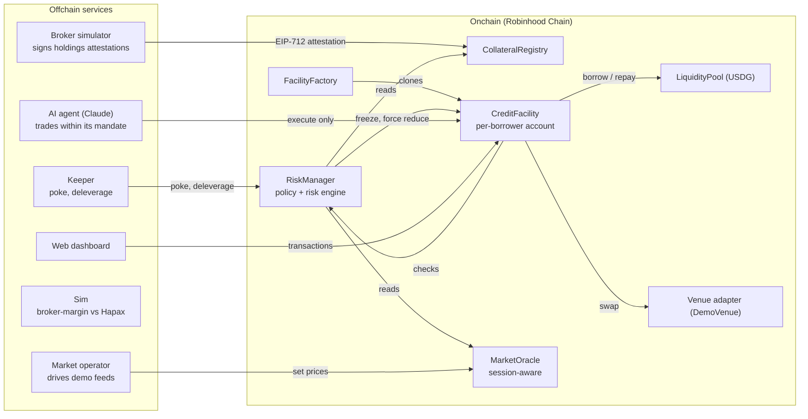

# Hapax: Buying Power for AI Agents, Not Keys

**Target:** Arbitrum Open House Singapore, Online Buildathon — Promising Products (AI agents, new financial primitives), Open category (Robinhood Chain), USDG bonus.
**Chain:** Robinhood Chain (Arbitrum Orbit). Testnet 46630, mainnet 4663.
**Status:** Contracts deployed and verified on Robinhood Chain testnet; 31 scenario tests green; full offchain stack and dashboard. Live addresses in [DEPLOYMENTS.md](DEPLOYMENTS.md).

---

## 1. Thesis

Robinhood already lets an AI agent trade for you: since May 2026, Robinhood Agentic Trading gives an agent a separate account funded with cash you move into it. What it does **not** give the agent is credit. To let an agent trade $300k, you first move $300k of cash into its account, or sell stock to raise it. Broker margin cannot be handed to an agent under limits it cannot break, and it stops repricing at Friday's close.

**Hapax gives an AI agent buying power, not keys.**

1. Your **broker attests your holdings** (shares, not dollars) with an EIP-712 signature. That sets an onchain credit limit. Your stocks never move and are never sold.
2. You draw **USDG** on Robinhood Chain into a **facility** — a per-borrower smart account.
3. You appoint an **agent** with a **mandate**: which stocks it may buy, a per-position cap, and an expiry. The agent can trade, but it can **never borrow, withdraw, or move funds anywhere except allowlisted venues**. Anything outside the mandate reverts onchain.
4. A **24/7 risk engine** watches every position. It deleverages automatically when risk rises and **freezes the facility in the same block** if the broker revokes.

Because the borrowed USDG cannot leave the facility, the collateral only has to cover what the agent could *lose*, not the face value of the loan. That gives roughly **4× the buying power** of cash-out credit on the same account: a $400k brokerage account supports ~$700k of agent buying power while the market is open, versus ~$175k of cash-out margin.

The novel combination: **agent credit backed by shares that stay at the broker, sized by exposure because the money cannot leave, with a risk engine that keeps working when the stock market is closed.** Agent mandates exist (Coinbase Agentic Wallets, Lit). Agent credit with signed bounds exists (Atlas Prime Book). We have not found the three together, over brokerage equities.

## 2. Why Robinhood Chain, and only here

1. **Same asset on both sides.** The offchain collateral (100 TSLA at the broker) and the onchain market (the TSLA stock token) are the same instrument, so the onchain price is a valid weekend signal for the offchain collateral. No other chain has a native, issuer-backed stock-token market to read from.
2. **The 24/5 vs 24/7 gap is real.** Robinhood's reference stock feeds update during market hours; the stock tokens trade 24/7. Any lender marking stocks with the reference feed alone is marking at Friday's close all weekend. Hapax has a session-aware oracle that switches to the live market when the reference is stale.
3. **USDG is the settlement currency** for stock tokens on the chain: the pool lends USDG, the venue quotes USDG, repayment is USDG.
4. **The broker is the natural custodian.** Robinhood already custodies the shares; an attestation keyed by stock-token address is a drop-in path for a real brokerage integration.
5. **Robinhood already runs agentic trading.** Hapax is the missing credit layer for it.

## 3. System overview



**Design rules.** (1) Every state-increasing action calls `RiskManager.evaluate` and checks attestation status at action time — freeze is instantaneous; the keeper only persists state for UX and timers. (2) The keeper supplies no calldata; forced reduction sells through the default venue with oracle-bounded slippage. (3) Adapters are typed (`swap(tokenIn, tokenOut, amountIn, minOut)`); the facility measures its own balance deltas rather than trusting the adapter's return. (4) Pausing never blocks repay or reduce. (5) Collateral is valued in shares — the broker attests *what you hold*, the chain decides *what it is worth now*.

## 4. Core mechanism and math

All USD values are 18-decimal fixed point (WAD) internally; USDG has 6 decimals, stock tokens 18.

**Session and mark price.** Each asset has a reference feed and a live feed. Session is derived per asset from the reference feed's freshness (no calendar is hard-coded, so holidays work automatically):

```
session = OPEN   if now - refUpdatedAt <= refHeartbeat, else CLOSED
OPEN:   mark = P_ref   (if |P_live - P_ref| / P_ref > maxDeviation, mark = min(P_ref, P_live))
CLOSED: mark = min(P_ref_last, P_live)         (P_live must be fresher than liveMaxAge)
CLOSED and P_live stale: mark = P_ref_last, flag DEGRADED, new borrows/increases blocked
```

`min` is conservative in both directions: a weekend crash is seen immediately, a weekend pump never inflates collateral above Friday's close.

**Credit limit** (from the attestation: positions `(asset, shares)`, `cashUsd`, `encumberedUsd`):

```
haircut_i     = session==OPEN ? haircutBps_i : weekendHaircutBps_i
eligibleValue = sum(shares_i * mark_i * (1 - haircut_i)) + cashUsd - encumberedUsd
creditLimit   = min(eligibleValue * maxLtv, maxCreditPerFacility)
```

The limit shrinks automatically at Friday's close (wider weekend haircut) and tracks the weekend market, with no re-signing.

**The two signals.** With debt `D`, facility assets `A = idleUSDG + sum(tokenBal_j * mark_j)` and stressed assets `A_s = idleUSDG + sum(tokenBal_j * mark_j * (1 - haircut_j))`:

| Signal | Formula | Meaning |
|---|---|---|
| **Utilization** `U` | `max(0, D - A_s) / creditLimit` | How much brokerage-backed credit the *stressed loss* uses |
| **Health** `H` | `A / D` | How much of the borrowed USDG the facility can still cover |

`U` uses **exposure** `E = max(0, D - A_s)`: borrowed USDG and whatever it buys stay in the facility where the lender can see and sell them, so the collateral backs only the stressed loss, not the face value. This is why the same $400k account supports ~$700k of open-market buying power (`creditLimit × maxBorrowUtil / haircut`) versus ~$175k of cash-out credit (`creditLimit × maxBorrowUtil`).

**Severity** (risk level is the worse of the two, with `hysteresisBps` on downgrades):

| Level | `U` ≥ | `H` < |
|---|---|---|
| WARNING | 0.80 | 0.95 |
| MARGIN_CALL | 0.90 | 0.90 |
| DELEVERAGING | 1.00 | 0.85 |

**Initial margin:** new risk must leave `U ≤ 0.70` under the current session's haircuts; a borrow is checked as if fully invested in the riskiest tradeable stock, and every buy is re-checked after it settles. **Attestation status** (NONE / VALID / STALE / REVOKED) is separate: STALE or REVOKED forces FROZEN regardless of risk.

**State machine.**

```mermaid
stateDiagram-v2
  [*] --> ACTIVE
  ACTIVE --> WARNING: soft threshold
  WARNING --> MARGIN_CALL: call threshold
  MARGIN_CALL --> DELEVERAGING: deleverage threshold
  DELEVERAGING --> CURE: flattened, residual remains
  DELEVERAGING --> ACTIVE: flattened, no residual
  ACTIVE --> FROZEN: attestation revoked/stale
  WARNING --> FROZEN: attestation revoked/stale
  MARGIN_CALL --> FROZEN: attestation revoked/stale
  FROZEN --> ACTIVE: fresh valid attestation
  FROZEN --> CURE: force-reduced, residual remains
  CURE --> ACTIVE: borrower repays residual
  CURE --> DEFAULT: cure window expires
  FROZEN --> DEFAULT: frozen past defaultGrace with debt
  DEFAULT --> CLOSED: broker settlement confirmed
```

`freezeGrace < defaultGrace`, so a frozen facility is unwound before it can default. Entering DEFAULT emits `ResolutionRequested` to the broker in the same transaction.

**The agent mandate.** The owner calls `setAgent(agent, expiresAt, maxPositionUsd, tokens[])`. Until expiry the agent may buy stocks on its list up to `maxPositionUsd` per stock (and every global limit), sell any holding back to USDG, and repay. It may **not** buy off-list (`OutsideMandate`), exceed the cap (`PositionTooLarge`), or borrow / withdraw / change its mandate / send funds anywhere but allowlisted venues (`Unauthorized`). `revokeAgent()` is the owner's kill switch. Agent actions pass the same state checks as the owner's, so it cannot add risk in MARGIN_CALL or worse.

**Forced reduction.** Anyone calls `RiskManager.deleverage(facility)` when the fresh evaluation allows it. The facility sells every allowlisted holding to USDG through the default venue with `minOut` from `P_live` and `maxSlippageBps`; a capped tip goes to the caller, the rest repays debt. Residual debt → CURE; none → ACTIVE.

**Default parameters** (testnet demo; `contracts/script/DemoConfig.sol`): haircut 2500 bps open / 4000 bps closed, `maxLtv` 80%, initial margin `U ≤ 0.70`, `maxSlippage` 100 bps, `keeperTip` 25 bps, `cureWindow` 120 s, `freezeGrace`/`defaultGrace` 120 s / 300 s, `hysteresis` 200 bps, attestation TTL ≤ 1 h.

## 5. Onchain components

- **CollateralRegistry** — verifies and stores EIP-712 holdings attestations (domain `Hapax` v1, chainId, verifyingContract). Accepts only an approved broker signer, strictly increasing nonce, future expiry, bounded TTL, borrower = facility owner, every asset registered in the oracle, ≤ 8 positions. `revoke(facility, reason)`; expiry is the dead-man switch.
- **FacilityFactory / CreditFacility** — the factory deploys ERC-1167 clones (one per borrower) and keeps the list the keeper iterates. The facility holds USDG and stock tokens; debt lives in the pool, keyed by facility address. Owner: `borrow`, `repay`, `deposit`, `trade`, `withdrawSurplus`, `setAgent`, `revokeAgent`. Agent: `trade`, `repay`. RiskManager only: `forceSell`, `forceRepay`, `pay`.
- **MarketOracle** — per asset: ref/live feeds (AggregatorV3), heartbeats, max deviation, open/weekend haircuts. `quote(asset) → (mark, live, session, degraded)`. USDG is $1. Mainnet adds a USDG/USD feed with a depeg guard and an L2 sequencer-uptime check.
- **LiquidityPool** — USDG only; `supply`/`withdraw` for the lender, `borrow`/`repay` for facilities, a fixed-APR interest index within hard bounds, `absorbLoss`. Accounting identity holds after every action.
- **RiskManager** — owns bounded policy/risk parameters. `evaluate` (view, used by every action and the keeper), `poke` (permissionless, idempotent, persists state and timers), `deleverage` (permissionless when allowed), `confirmSettlement` (broker), `absorbLoss` routing.
- **Venue adapter** — `DemoVenue`: inventory-based, quotes at `P_live` with a fixed spread, funded by the operator. A Uniswap v3 adapter is a documented extension.

## 6. Offchain components

| Component | Port | Responsibility |
|---|---|---|
| **Broker simulator** | 8787 | Mock brokerage accounts; signs holdings attestations on a timer. Operator API: revoke, encumber, holdings, settle. |
| **Keeper** | — | Each block: evaluate facilities, `poke` on state change, `deleverage` when allowed. Permissionless; anyone can run one. |
| **Market operator** | 8788 | Drives the demo feeds: close the session (backdate the reference past its heartbeat), shock a price, reopen. |
| **Agent** | 8789 | Holds the facility's agent key. Each tick: reads facility + market state, asks Claude (`claude-opus-5-5`, structured output) for trades given the owner's plain-English instructions, simulates, submits, logs onchain refusals by error name. Falls back to a deterministic rules strategy with no API key or on error. |
| **Sim** | 8790 | Pure, chain-free weekend-gap simulation: broker-only margin (acts at Monday's open) vs Hapax (deleverages when the live mark first breaches a threshold), with lender loss for each. `GET /sim`, `POST /sim` to override the scenario. |
| **Web dashboard** | 5173 | Buying power, session badge, U/H gauges, state timeline, mandate panel, agent decision feed with onchain refusals, demo console. Vite + React + viem/wagmi. |

## 7. Trust boundaries (real vs simulated)

| Real (built, tested, deployed) | Simulated / disclosed |
|---|---|
| EIP-712 attestations: verification, expiry, nonces, revocation | The broker — a service we run that signs attestations |
| Facility smart account and per-action policy checks | Legal enforceability of the pledge |
| Session-aware oracle (reference vs live, OPEN/CLOSED, DEGRADED) | **Price feeds** are operator-controlled demo feeds — even on testnet, because Robinhood's testnet stock feeds are themselves mocks; this makes the crash scene repeatable (badged in the UI) |
| Exposure-based credit and the agent mandate, enforced onchain | **Tokens on the live deploy are mock ERC-20s**: the faucet caps at ~5 shares and USDG is not mintable by us, below the ~$1M the demo needs. Same symbols/decimals/wiring; real addresses in [DEPLOYMENTS.md](DEPLOYMENTS.md) |
| Two-signal risk engine, state machine, permissionless deleverage | Broker-side sale of shares on default (event + stub settlement) |
| AI agent trading through the mandate (Claude, rules fallback) | Venue liquidity: one demo venue priced off the live feed |
| Keeper, broker, market, sim services; dashboard | Lender liquidity: one pool, test funds |
| Contracts deployed and **verified** on Robinhood Chain testnet | |

## 8. Open production problems

- **Legal enforceability** of the pledge — the attestation is a technical primitive, not a lien. A real deployment needs a custody/pledge agreement the broker honours.
- **Cross-broker double-pledge** — nothing stops the same shares being attested to two facilities across brokers. Needs a shared registry or custody lock.
- **Real brokerage integration** — the broker here is our signer; production needs a brokerage API and key custody under timelock + multisig.
- **Oracle manipulation on thin weekend liquidity** — the live mark should be a TWAP on mainnet; the `min` rule means manipulation can only *lower* marks (griefing, bounded by hysteresis/cure, not theft), plus per-token exposure caps.
- **USDG depeg / freeze / blacklist** — a depeg guard blocks new borrows; freeze/blacklist risk is documented and un-handled in the MVP.
- **Sequencer uptime** — mainnet must check the L2 sequencer feed before trusting any price.
- **Custody privacy** — the attestation carries a salted hash of the account reference, no PII; stronger privacy (proofs) is out of scope.

## 9. Positioning

| Prior art | Does | Does not |
|---|---|---|
| Robinhood Agentic Trading | Agent trades in a separate cash account; kill switch | Buying power is only the cash you move in; limits live in a backend; no weekends |
| Coinbase Agentic Wallets, Lit | Agent wallets with spend limits, whitelists, expiry | Spend the agent's own funds; no credit, no brokerage collateral |
| Atlas Prime Book | Agent credit bounded by a signed permission | Crypto collateral and crypto perps; no equities, no market-hours model |
| Broker margin (Gold, SBLOCs) | Credit against held stock | Not delegable to an agent under enforceable limits; cash leaves; offchain; reprices only in market hours |
| Kamino / Aave forks (xStocks, RWA) | Borrow stablecoins against tokenized stock | Collateral must already be tokenized and moved onchain; borrowed cash unrestricted; no agent mandate |
| Gearbox Credit Accounts | Isolated account restricted to allowed contracts | Crypto only; no brokerage collateral; no agent mandate or market-hours model |

## 10. Testing

31 deterministic scenario tests (`contracts/test/Scenarios.t.sol`), one per demo scene and guardrail: revoke → frozen in the same block; stale attestation → frozen; Friday close shrinks the limit and buying power with no transaction; Saturday crash → deleverage → cure → default → settlement, including a pool-absorbed shortfall; weekend pump does not raise the limit; exposure-based buying power and initial margin on buys; the full agent mandate (token list, position cap, no keys, sells always allowed, kill switch, expiry); policy blocks an unlisted adapter and withdrawal of borrowed funds; attestation replay, unknown signer, borrower mismatch; the full demo storyline. Invariants the suite encodes: debt never exceeds the limit at borrow; no risk-adding action in MARGIN_CALL or worse; assets leave only via repay / swap / surplus withdrawal / tip / settlement; pool accounting identity holds; nonces strictly increase; closed-session mark never exceeds the last reference; `poke` is idempotent; forced reduction never executes worse than the slippage bound. Stateful invariant fuzzing is the natural next step and is not yet written.

## 11. Repository layout

```
contracts/  Foundry: oracle, registry, pool, risk manager, factory, facility, demo venue/feeds, mocks
shared/     Chain config, generated ABIs, EIP-712 types (used by every TS package)
broker/     Broker simulator (attestation signer + operator API)
keeper/     Block loop: evaluate, poke, deleverage
market/     Demo market operator: open/close the session, move prices
agent/      AI agent: Claude turns instructions into trades through the agent key
sim/        Weekend-gap simulation endpoint: broker-only margin vs Hapax
web/        Dashboard and demo console
docs/       This write-up and live deployment addresses
```

Toolchain: Solidity 0.8.24, Foundry, OpenZeppelin 5, viem/wagmi, Node 20+, pnpm workspaces. Deployed addresses and the mock-token disclosure: [DEPLOYMENTS.md](DEPLOYMENTS.md).
